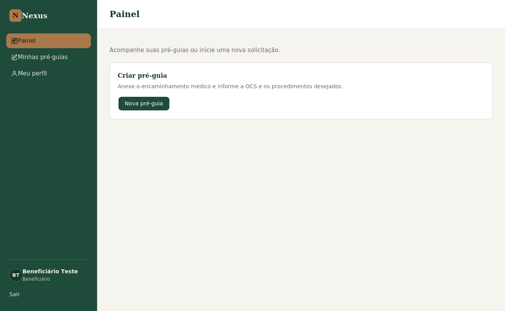
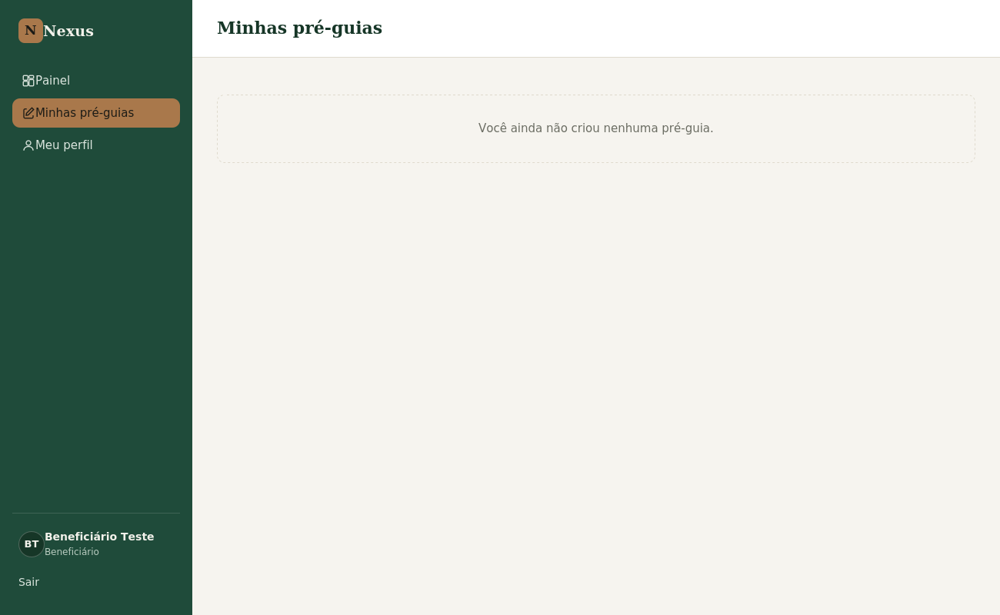
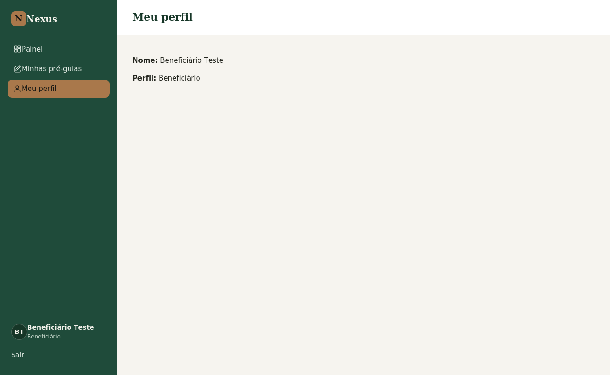
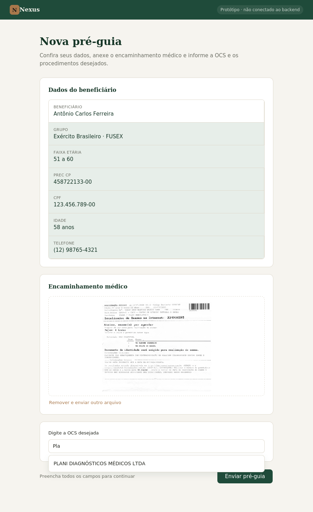

📋 Especificação Técnica do Sistema FUSEX

* * *

1. Visão Geral

* * *

**Nome sugerido do sistema:** Nexus

**Stack obrigatória:**

* Linguagem: Java (versão 17+ recomendada)
* Java Spring Boot
* Banco de dados: MySQL

**Objetivo:** Facilitar o fluxo de trabalho do FUSEX, eliminando burocracias repetitivas e probabilidade de erros humanos durante o processo (dupla cobrança de guias, assinaturas ausentes ou faltantes, erros de lisuras, etc). Também será necessário automatizar o processo de rastreabilidade (lisuras e glosas).

* * *

2. Princípio de UX Central

* * *

> **O sistema deve minimizar ao máximo o número de cliques e interações necessárias.** Sempre que possível, use preenchimento automático, herança de dados de períodos anteriores, propagação de configurações entre entidades similares e confirmação em lote.

**Responsividade:** interface adaptável para celular (beneficiários) e desktop (funcionários do FUSEX).

**Feedback:** toda ação que dispara requisição deve indicar loading, sucesso ou erro de forma clara.

**Formulários:** validação no front-end antes do envio; pré-preenchimento de dados já conhecidos do usuário.

**Ações críticas:** operações irreversíveis (ex: protocolar o Mapa) exigem confirmação explícita, mesmo custando um clique extra.

* * *

3. Contexto de Domínio — Glossário Obrigatório

* * *

Antes de iniciar o desenvolvimento da aplicação, o desenvolvedor deve internalizar os seguintes conceitos, pois eles se repetem em todo o sistema:

| Termo | Definição                                                                                                                                                                                                                          |
| ------------------------------ |------------------------------------------------------------------------------------------------------------------------------------------------------------------------------------------------------------------------------------|
| **FUSEX**                      | Sigla para **Fundo de Saúde do Exército**, um sistema de assistência médico-hospitalar destinado aos **beneficiários** do exército                                                                                                 |
| **Beneficiário**               | São os militares do Exército (da ativa, reserva ou reformados) e a pensionistas, que atuam como titulares. O direito se estende aos seus dependentes diretos legalmente cadastrados, como cônjuges e filhos menores ou estudantes. |
| **Encaminhamento médico**      | Documento criado pelo médico e entregue posteriormente ao beneficiário, para a criação da Pré-Guia.                                                                                                                                |
| **Pré-Guia de Encaminhamento** | Documento criado (já dentro da aplicação) pelo beneficiário, constando a **OCS** e os procedimentos/exames médicos a serem realizados. **Necessário ter o encaminhamento médico para criá-la.**                                    |
| **Guia de Encaminhamento**     | Documento gerado pelo FUSEX, contendo: a **OCS** escolhida, os procedimentos, número, assinatura do médico e do chefe do FUSEX, etc. **Necessário ter a Pré-Guia aprovada pelo FUSEX para ser gerado.**                            |
| **OCS**                        | Representa toda a **rede credenciada, conveniada ou contratada de caráter privado ou público** (que não pertence ao Exército) utilizada para prestar assistência médica aos beneficiários do FUSEX.                                |
| **Espelho**                    | Documento gerado pela OCS após a realização do(s) exame(s) do beneficiário, constando todos os gastos referentes ao(s) exame(s). **Cada guia possui um espelho**.                                                                  |
| **Fatura**                     | Documento gerado pela OCS dentro de um período (geralmente de 1 mês). É a somatória de todas as guias que já foram utilizadas e que a OCS devolveu ao FUSEX (ou seja: guias que já possuem **espelho**).                           |
| **Lisura**                     | Procedimento que faz parte da **rastreabilidade**, para conferir se todos os valores estão em conformidade. **Não há como realizar a lisura de uma guia sem possuir o espelho**.                                                   |
| **Glosa**                      | Procedimento que faz parte da lisura, caso seja encontrado **divergências** de valores entre o **espelho** e os valores descritos no **contrato** firmado entre a OCS e o FUSEX.                                                   |
| **Mapa**                       | É a auditoria final de todas as guias, feito após o processo de lisura/glosa dentro do FUSEX. É o último processo antes da **liquidação**.                                                                                         |
| **Liquidação**                 | Processo final, onde o exército realiza o pagamento da fatura.                                                                                                                                                                     |

* * *

4. Regras de Negócio

* * *

### 4.1 Encaminhamento e Pré-Guia

| Código | Regra                                                                                                         | Observação                                                          |
|--------|---------------------------------------------------------------------------------------------------------------|---------------------------------------------------------------------|
| RN01 | Não é possível criar uma Pré-Guia sem um encaminhamento médico válido vinculado ao beneficiário.              | Validação obrigatória antes da criação da Pré-Guia.                 |
| RN02 | São aceitos os encaminhamentos médicos de qualquer clínica, não sendo necessário vir de uma OCS credenciada.  | Não restringir a anexação do Encaminhamento a uma OCS pré-definida. |
| RN03 | A Pré-Guia deve conter obrigatoriamente os dados do beneficiário, o encaminhamento anexado e a OCS escolhida. | Bloquear envio da Pré-Guia se algum desses campos estiver vazio.    |

* * *

5. Protótipos de Telas

* * *

### 5.1 Telas do beneficiário

**Tela 1 — Painel**

Tela inicial do beneficiário ao logar, com acesso rápido à criação de uma nova pré-guia.

**Tela 2 — Minhas pré-guias**

Lista das pré-guias já criadas pelo beneficiário logado.

**Tela 3 — Meu perfil**

Dados de cadastro do beneficiário logado.

**Tela 4 — Nova pré-guia**

Tela de criação da pré-guia: dados do beneficiário (somente leitura), upload do encaminhamento médico e busca da OCS desejada.

* * *